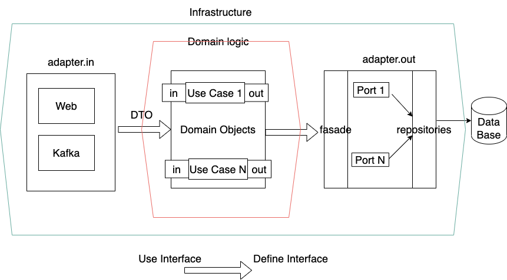

## Example Implementation of a Hexagonal Architecture

It implements a domain-centric "Hexagonal" approach of a common web application with 
Java and Spring Boot. 



NOTE:
 This is the companion code to [Hexagonal Architecture for Microservices](https://confluence.neterra.paysafe.com/display/paymentnetwork/Hexagonal+Architecture+for+Microservices)
article.

## Additional Companion Articles

* [Hexagonal Architecture with Java and Spring](https://reflectoring.io/spring-hexagonal/)
* [Mapping with MapStruct]( https://reflectoring.io/java-mapping-with-mapstruct/)
* [Bean Validation](https://reflectoring.io/bean-validation-with-spring-boot)
* [Detect unused code](https://blog.jdriven.com/2021/01/detect-delete-unreferenced-code-with-archunit)
* [Architecture Decision Records](https://gitlab.paysafe.cloud/paysafe/digital-wallets/principles_community/-/blob/master/docs/justifications/whyADRs.md)

## Books

* [Patterns, Principles, and Practices of Domain-Driven Design](https://www.oreilly.com/library/view/patterns-principles-and/9781118714706/)
* [Secure by Design](https://www.oreilly.com/library/view/secure-by-design/9781617294358/)
* [Get Your Hands Dirty on Clean Architecture](https://www.oreilly.com/library/view/get-your-hands/9781839211966/) (example project is inspired by this book)

## Frameworks

* [DDD annotations](https://github.com/xmolecules/jmolecules)
* [Bean validation](https://beanvalidation.org)
* [MapStruct](https://mapstruct.org)
* [jooq](https://www.jooq.org)
* [OpenAPI](https://www.openapis.org)
* [Log4brains](https://github.com/thomvaill/log4brains)

## Build

* JDK 11
* This project uses Lombok, so enable annotation processing in your IDE

```shell
$ mvn clean install
```

## Start locally

Run from IDE as Spring boot project. Initially application has two users with ids `5` and `6`.
You can check if `5` can send 10 money to `6` with following `curl` request:

```shell
curl -X POST -H "Content-Type: application/json"  localhost:8080//accounts/send/5/6/10
```